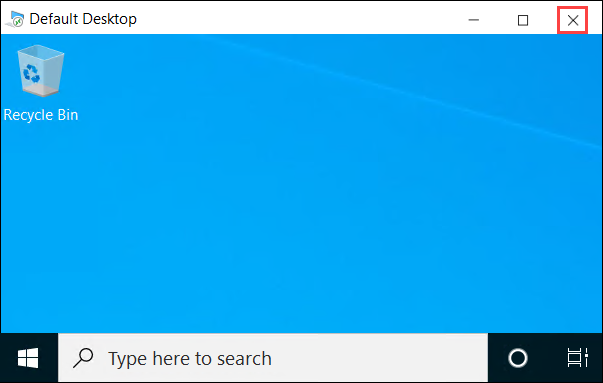

# **Exercise 4: Access the Published Applications and Desktop using WVD Desktop Client**

In this exercise, we will access the Desktop and RemoteApps assigned to us in the previous exercise using WVD Desktop client.

> **Note:** **You have to perform this exercise in your local system(i.e., personal systems). Do not perform this exercise within the JumpVM.**


## **Task 1: Access the Published Applications**

1. Open a browser in your **Local Systems** (not within the JumpVM), copy and paste the following URL in that browser tab.

   ```https://docs.microsoft.com/en-us/azure/virtual-desktop/connect-windows-7-10#install-the-windows-desktop-client```

2. Under *Install the Windows Desktop Client*, click on **Windows 64-bit**. This will download the **WVD Desktop Client** on your local machine.
   
   
      
3. After the download completes, open the setup to run it. Then on the Welcome page of setup click on **Next**.

4. Check the agreement box and click on **Next**.

5. On **Installation scope** window select **Install just for you** and then click on **Install**.

   

6. After installation, in your local machine go to **Start** and search for **Remote desktop** and open the remote desktop application with exact icon as shown below.

   
   
   
7. Once the application opens, click on **Subscribe**.

   
  
  
8. Enter your **credentials** to access the workspace.

   - Username: *Paste your username* **<inject key="AzureAdUserEmail" />** *and then click on **Next**.*
   
   

   - Password: *Paste the password* **<inject key="AzureAdUserPassword" />** *and click on **Sign in**.*

   
   
   
9. Make sure to **uncheck** *Allow my organization to manage my device* and click on **OK**.

   
   
   
10. The WVD dashboard will launch, then double click on **Excel** application to access it.

   
   

11. A window saying *Starting your app*, will appear. Wait for few seconds, then enter your password to access the Application.

   - Password: **<inject key="AzureAdUserPassword" />**
   
   
   
12. Wait for the Application to connect.

   
   

13. The Excel application will launch and look similar to the screenshot below.

    
    
14. You can exit from the window of Excel Application by clicking on **X *i.e., the close button***.

   
   
## **Task 2: Access the Virtual Desktop**


1. In your local machine go to **Start** and search for **Remote desktop** and open the remote desktop application with icon similar to the one shown below.

   
 
2. The WVD client application will launch and we will land on the WVD dashboard. Click on the tile named **Default Desktop** to launch the desktop.

   
   

3. A window saying *Connecting to: Default Desktop* will appear. Wait for few seconds, then enter your password to access the Desktop.

   - Password: **<inject key="AzureAdUserPassword" />**
   
   
   

4. Wait for the Default Desktop to connect.

   
   

5. Your virtual desktop will launch and look similar to the screenshot below. You can exit from the window by clicking on **X *i.e., the close button***. 
        
      
    
     
6. Click on the **Next** button present in the bottom-right corner of this lab guide. 
